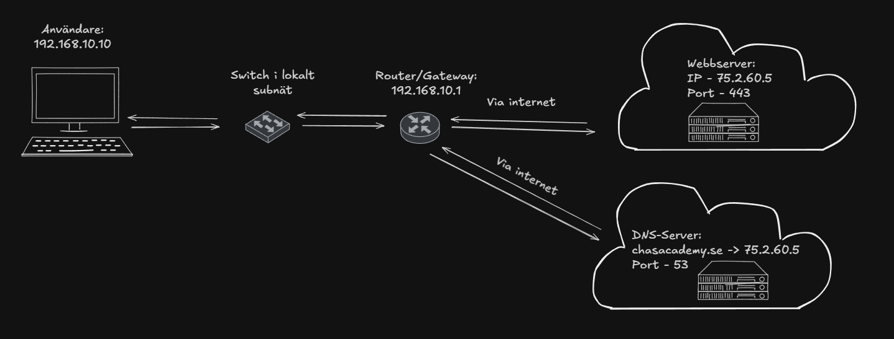

# Individuell Fördjuppning  
## Av:   Liam Jakbosson ISCX2026  

### Moment A: Avancerad Nätverksanalys & Trafikflöden

  

**1. Klienten tar reda på serverns IP-Adress**  
Först o främst måste klienten veta vart den ska. Med hjälp av en DNS-Server så skickar klienten ett domännamn (det som är lättläsligt för gemeneman), i detta fallet ``chasacademy.se``, som DNS översätter till en ipadress (IP: 75.2.60.5) och skickar tillbaka, detta gör den normalt med UDP. Detta gör så att vi vet vart vi ska och kan börja skicka trafiken. 

**2. Klienten skickar trafiken till sin gateway** 
Klienten har adressen ``192.168.10.10/24``. Den jämför desitanitonens IP-Adress med sitt eget subnät och ser att webbservern befinner sig utanför det. Därför skickas trafiken till standardgatewayen ``192.168.10.1`` Vilket är det samma som routern. Man kan likna det med dörren ut på ett hus, ut till internetet.

Klienten användre ARP för att ta reda på gatewayens MAC-Adress, om inte den redan finns sparad.

Den första ramen mot webbservern innehåller då:
| Fäl | Värde |
| --- | ---- |
| Avsändar-MAC| 08:00:27:97:60:cd |
| Mottagar-MAC | Gatewayens MAC-Adress (VM saknar Gateway) |
| Avsändar-IP | 192.169.10.10 |
| Mottagar-IP | 75.2.60.5 |
| Avsändarport |Tillfälig port |
| Mottagarport | 443 för HTTPS |

Motagarens MAC-Adress tillhör gatewayn, men mottagarens IP-Adress tillhör webbservern.

**3. Switch och router skickar vidare trafiken** 
Switchen använder motagarens MAC-Adress för att skicka ramen till rätt port i det lokala nätverket. Routern tar bort den inkommande länklagerramen och läser destinationens IP-Adress för att välja nästa våg. det skapar en ny ram för nästa länk/router. På Ethernet för ramen routerns utgående MAC-Adress som avsändaren och nästa hopps MAC-Adress som mottagare.

vid vanlig internetåtkomst översätter NAT klientens avsändar-IP till en publik IP-Adress. PAT kan även ändra avsändarporten och håller reda på vilken klient svarstrafiken ska tillbaka till.